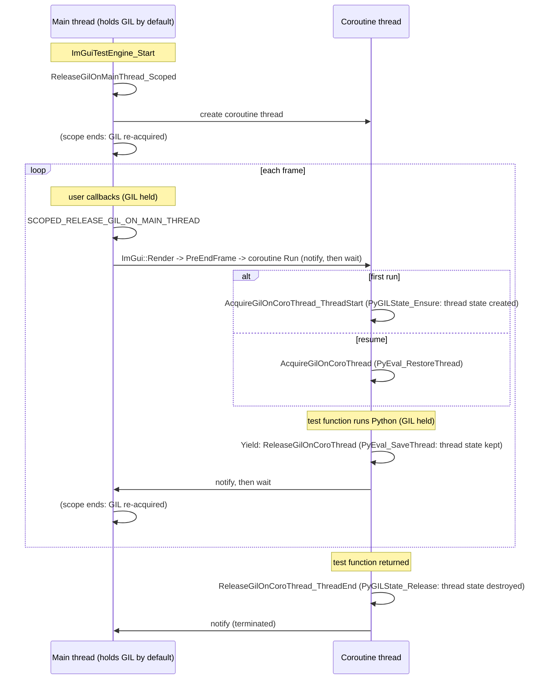

# Python GIL handling in the ImGui Test Engine coroutine

This applies when the test engine is used from Python (`IMGUI_TEST_ENGINE_WITH_PYTHON_GIL`),
with the `std::thread` coroutine implementation.

`imgui_te_python_gil.jpg` is the original hand-drawn sketch. Its thread synchronization part
(condition variable + mutex) is unchanged; this document adds the Python thread-state lifetime,
which the sketch does not show.

## The two threads

- **Main thread**: runs the GUI loop. It holds the GIL by default, since it entered C++ from
  Python (`hello_imgui.run()`). It may call Python at any time through user callbacks.
- **Coroutine thread** ("Main Dear ImGui Test Thread"): runs the test functions. It may call
  Python too (the test functions are Python callables).

The two threads never run concurrently: the coroutine implementation serializes them with a
condition variable. Whichever thread is running must hold the GIL if it calls Python, so the
GIL is handed back and forth along with control.

## Main thread: release the GIL while the coroutine may run

The main thread releases the GIL in scoped blocks (`ReleaseGilOnMainThread_Scoped`, or the
`SCOPED_RELEASE_GIL_ON_MAIN_THREAD` macro in HelloImGui's `abstract_runner.cpp`):

- in the test engine: around coroutine creation (`ImGuiTestEngine_Start`) and around the final
  run-until-exit loop (`ImGuiTestEngine_CoroutineStopAndJoin`);
- in HelloImGui, once per frame: around `ImGui::Render()`. Ending the frame calls the engine's
  `PreEndFrame` hook, which resumes the coroutine for one step. Other blocks (layout, window
  sizing, idling, platform backend new frame) release the GIL too, but do not run the coroutine.

**Rule: no user callback may run inside such a block.** A user callback would try to call
Python on the main thread while the GIL is released.

## Coroutine thread: one thread state for the whole thread lifetime

The coroutine thread owns a single Python thread state, created when the thread starts running
user code and destroyed when the user code has returned. Yields only pass the GIL, they never
touch the thread state:

| Moment | Call (in `imgui_te_coroutine.cpp`) | Python API | Thread state |
|---|---|---|---|
| thread starts running user code | `AcquireGilOnCoroThread_ThreadStart()` | `PyGILState_Ensure` | created |
| yield: pause | `ReleaseGilOnCoroThread()` | `PyEval_SaveThread` | kept |
| yield: resume | `AcquireGilOnCoroThread()` | `PyEval_RestoreThread` | kept |
| user code returned | `ReleaseGilOnCoroThread_ThreadEnd()` | `PyGILState_Release` | destroyed |

**Why the thread state must survive yields.** A yield happens from inside the test function,
so Python frames of that function are live on the coroutine thread's thread state. Destroying
the thread state at that point corrupts them, and the process crashes when the test resumes.

`PyGILState_Ensure` / `PyGILState_Release` pairs around each yield are therefore not an option:
CPython destroys the thread state when the GIL-state counter of the thread drops to zero.
This used to work only because binding layers (pybind11, nanobind 2) nested their own
`PyGILState_Ensure` around the call into the Python test function, keeping the counter above
zero. nanobind 3 skips that nested call on Python 3.12+ when a thread state is already attached,
which exposed the problem. The protocol above does not depend on what the binding layer does.

## Sequence

